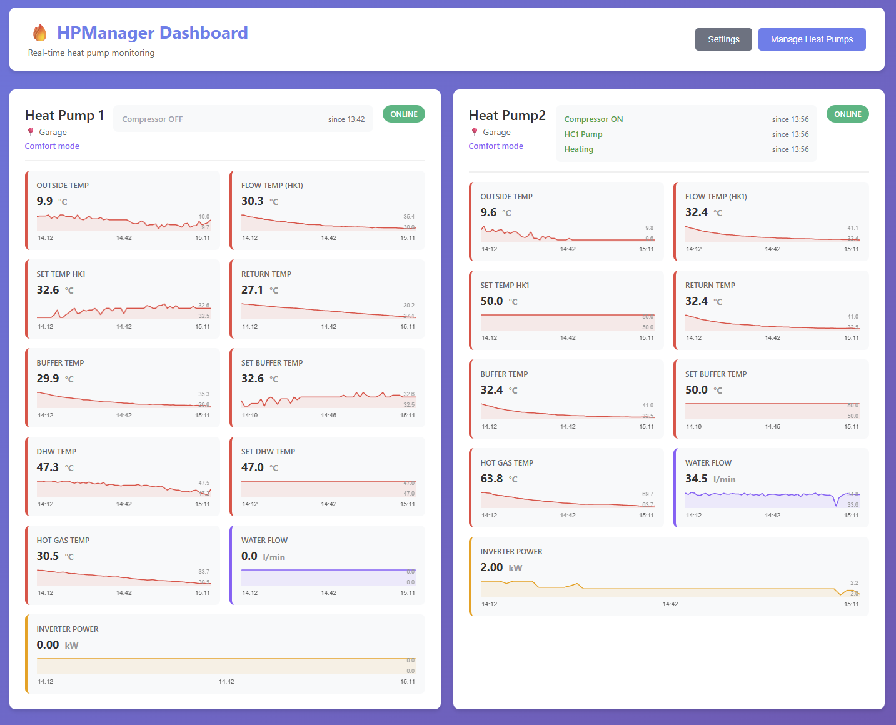

# HPManager - Heat Pump Monitoring System

A comprehensive monitoring system for heat pumps that communicates via Modbus, stores time-series data in InfluxDB, and provides a real-time web dashboard and Grafana visualizations.

> **Note:** This system has only been tested with **Stiebel Eltron** air source heat pumps (ASHP) using the ISG web interface for Modbus TCP connectivity. Other manufacturers or models may require different register mappings.



## Features

- **Modbus Communication**: Support for both TCP and RTU connections
- **Real-time Data Collection**: Concurrent polling of multiple heat pumps
- **Time-Series Storage**: InfluxDB for efficient metrics storage
- **Web Dashboard**: Built-in FastAPI web interface with live metrics, sparkline graphs, and operating status tracking
- **Grafana Integration**: Grafana dashboards for detailed monitoring and analysis
- **State Change Tracking**: Shows when each operating state (compressor, pump, heating mode, etc.) last changed
- **Resilient Design**: Automatic retry logic and error handling
- **Configurable**: YAML-based configuration for easy customization, with a web-based settings UI

## Architecture

The system consists of four main services, all running in Docker:

1. **Collector**: Python service that polls heat pumps via Modbus and writes data to InfluxDB
2. **Webapp**: FastAPI web dashboard showing live metrics, sparkline trend graphs, and operating state history
3. **InfluxDB**: Time-series database for storing heat pump metrics
4. **Grafana**: Visualization platform for creating detailed dashboards and monitoring

## Quick Start

### Prerequisites

- Docker and Docker Compose
- Python 3.11+ (for local development)
- Access to heat pump Modbus interface

### Configuration

1. **Configure Heat Pumps** (`config/heatpumps.yml`):
   - Add your heat pump IP addresses and Modbus settings
   - Set unique IDs and friendly names

2. **Configure Registers** (`config/registers.yml`):
   - Populate with Modbus register addresses from your heat pump documentation
   - Define data types, scales, and units

3. **Configure Collector** (`config/collector.yml`):
   - Adjust polling intervals
   - Set InfluxDB connection parameters
   - Configure logging preferences

### Running with Docker Compose

```bash
# Start all services
docker-compose up -d

# View logs
docker-compose logs -f collector

# Stop services
docker-compose down
```

### Access Services

- **Web Dashboard**: http://localhost:8080
  - Live metrics with sparkline trend graphs
  - Operating status with state change timestamps
  - Settings for poll interval, display fields, and sparkline time window

- **InfluxDB UI**: http://localhost:8086
  - Username: `admin`
  - Password: `adminpassword`

- **Grafana**: http://localhost:3000
  - Username: `admin`
  - Password: `admin`

## Development

### Local Setup

```bash
# Create virtual environment
python -m venv venv

# Activate virtual environment
# Windows:
venv\Scripts\activate
# Linux/Mac:
source venv/bin/activate

# Install dependencies
pip install -r requirements.txt

# Run collector locally
python -m src.collector.main
```

### Project Structure

```
HPManager/
├── src/
│   ├── collector/          # Data collection service
│   │   ├── main.py        # Entry point and orchestration
│   │   ├── modbus_client.py   # Modbus communication
│   │   ├── heatpump.py    # Heat pump device model
│   │   └── influx_writer.py   # InfluxDB client
│   └── webapp/            # FastAPI web dashboard
│       ├── app.py         # Routes and API endpoints
│       ├── config_manager.py  # YAML config management
│       ├── schemas.py     # Pydantic validation models
│       └── templates/     # Jinja2 HTML templates
├── config/
│   ├── heatpumps.yml     # Heat pump configurations
│   ├── registers.yml     # Modbus register mappings
│   ├── collector.yml     # Collector settings
│   └── display.yml       # Dashboard display settings
├── deploy/
│   └── setup.sh          # Proxmox LXC deployment script
├── docker/
│   └── Dockerfile.collector   # Collector container
├── docs/
│   └── proxmox-deployment.md  # Production deployment guide
├── grafana/
│   ├── dashboards/       # Dashboard definitions
│   └── provisioning/     # Grafana configuration
└── docker-compose.yml    # Service orchestration
```

## Configuration Guide

### Heat Pump Configuration

Edit `config/heatpumps.yml`:

```yaml
heatpumps:
  - id: hp1
    name: Main Heat Pump
    location: Basement
    model: your_model_name
    enabled: true
    modbus:
      type: tcp
      host: 192.168.1.100
      port: 502
      unit_id: 1
      timeout: 5
      retries: 3
```

### Register Mapping

Edit `config/registers.yml` with your heat pump's Modbus register addresses:

```yaml
models:
  your_model_name:
    description: "Your heat pump model"
    registers:
      - name: supply_temperature
        address: 100  # Your register address
        register_type: holding
        data_type: int16
        unit: celsius
        scale: 0.1
```

Refer to your heat pump's Modbus documentation for specific register addresses.

## Monitoring

### InfluxDB Data Explorer

1. Navigate to http://localhost:8086
2. Use the Data Explorer to query `heatpump_metrics`
3. View real-time data from your heat pumps

### Grafana Dashboards

1. Navigate to http://localhost:3000
2. Create dashboards using the pre-configured InfluxDB data source
3. Query the `heatpump_metrics` measurement with tags:
   - `heat_pump_id`: Unique heat pump identifier
   - `name`: Friendly name
   - `location`: Physical location
   - `model`: Heat pump model

## Troubleshooting

### Collector Not Starting

- Check logs: `docker-compose logs collector`
- Verify InfluxDB is healthy: `docker-compose ps`
- Ensure configuration files are valid YAML

### No Data in InfluxDB

- Verify Modbus connection to heat pump
- Check heat pump IP address and port in `config/heatpumps.yml`
- Review collector logs for connection errors
- Ensure register addresses in `config/registers.yml` are correct

### Grafana Can't Connect to InfluxDB

- Verify InfluxDB is running: `docker-compose ps influxdb`
- Check InfluxDB token in provisioning configuration
- Ensure network connectivity between containers

## Next Steps

1. Populate `config/registers.yml` with your specific heat pump register mappings
2. Customize polling intervals in `config/collector.yml`
3. Create Grafana dashboards for your specific monitoring needs
4. Set up alerts for temperature or power anomalies
5. Configure InfluxDB retention policies for long-term data management

## Production Deployment (Proxmox)

For a production deployment on Proxmox, see the full guide: [docs/proxmox-deployment.md](docs/proxmox-deployment.md)

Quick overview:
1. Create a **privileged Debian 12 LXC** with nesting enabled
2. Clone the repo and run `bash deploy/setup.sh`
3. The script installs Docker, generates secure credentials, configures direct LAN access to your heat pumps, and starts all services

## Security Notes

- The deployment script generates unique credentials automatically
- Use environment variables for sensitive tokens (see `.env.production` template)
- Restrict network access to Modbus interfaces
- Regularly update dependencies

## Tested Hardware

- **Stiebel Eltron WPM** series air source heat pumps via ISG web (Modbus TCP)

Other Stiebel Eltron models using the ISG interface should work with the included register mappings. For other manufacturers, you will need to create custom register definitions in `config/registers.yml`.

## License

[Add your license here]

## Support

For issues and questions, please refer to the project documentation or create an issue in the repository.
